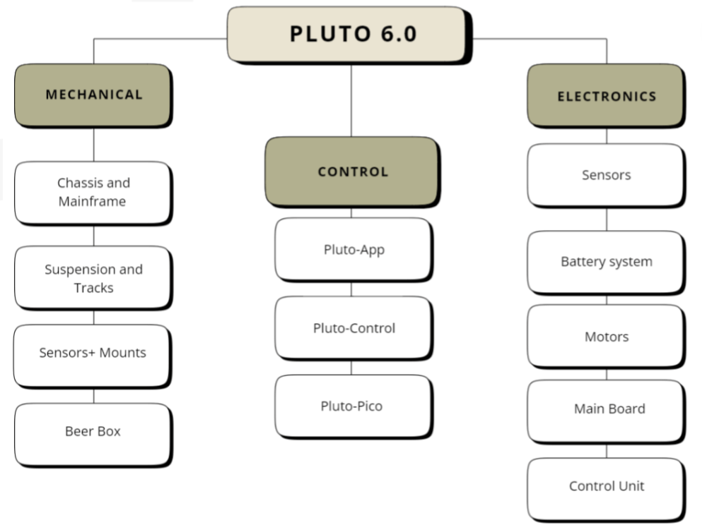

Introduction
============

.. image:: pluto-6.0.jpeg
  :width: 800
  :alt: Pluto 6.0

.. image:: groupPicture.jpeg
  :width: 800
  :alt: GroupPicture1

.. image:: groupPicture2.jpeg
  :width: 800
  :alt: GroupPicture2

Overview
--------
Pluto is a cyber-physical system that can be divided into several subsystems.
This documentation focusses on the subsystems **pluto-control** & **pluto-pico**.
For further documentation please visit: https://plutorobot.de/pluto-system-modell-overview/

.. image:: pluto_ros2-Pluto_overview.drawio.svg
  :width: 800
  :alt: Overview pluto_pico
