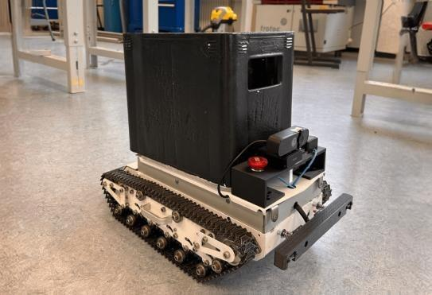

Introduction
============

Overview
--------
Pluto can be divided into several subsystems.

This documentation focuses on the subsystems **pluto-control** & **pluto-pico**.
For further documentation please visit: https://plutorobot.de/pluto-system-modell-overview/

.. image:: subsystems.png
  :width: 800
  :alt: Subsystems Pluto

Architecture
------------

To get a better understanding of the underlying software please have a look at the general architecture of Pluto.

.. image:: pluto_ros2-Pluto_overview.drawio.svg
  :width: 800
  :alt: Overview pluto_pico

The architecture of the Pluto system is designed with modularity and scalability in mind,
allowing for easy customization and future enhancements.

**The key benefits:**

* Modular subsystems
    Separation of complex systems into small, manageable subsystems with clearly defined functions.
    Enables reusability and maintainability for future generations of the system.
* Focused Development & Improvement
    Simplified structure allows for continuous focus on improvements and optimization.
    Facilitates the isolation of time-critical and safety-relevant functions within pluto-pico.
* Flexible Interface for Customers
    Provides a clear interface through **pluto-app**, ensuring customers have easy access to core functionalities.
    Abstracts embedded software components to pluto-pico for a streamlined user experience.
* Automated Configuration
    Automated setup of actuators and sensors using **pluto-control**, reducing manual configuration effort.
    Ensures consistent performance with minimal setup time.
* User-Friendly Interaction
    Includes a graphical user interface that simplifies system control.
    Transparent communication through **pluto-control**, ensuring seamless interaction between subsystems.
