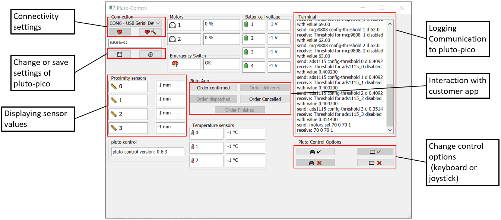
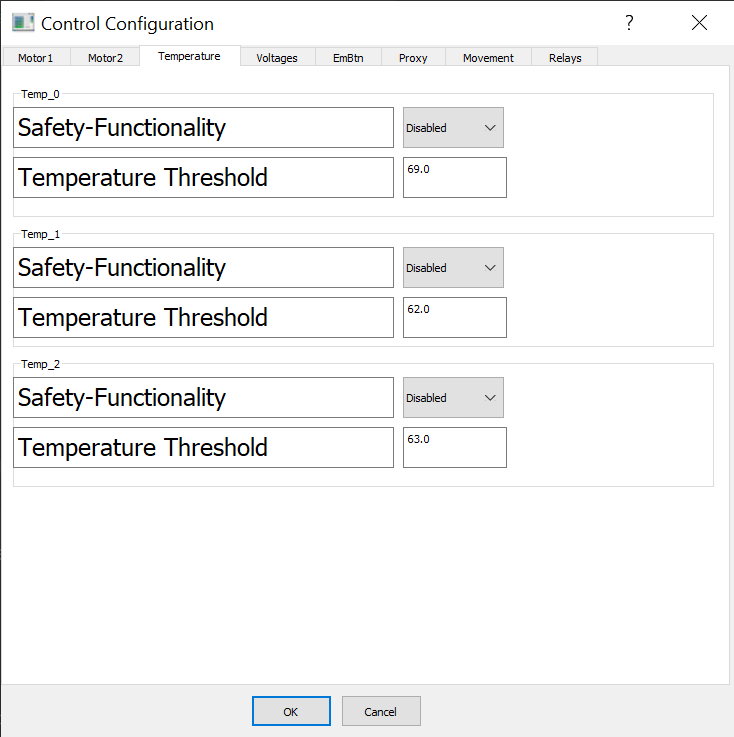

Tutorial: Setting up pluto-control:
-----------------------------------

Prerequisites
~~~~~~~~~~~~~

Since pluto-control is a python application some prerequiries are required.

* Install python (development has been done with python 3.12) from https://www.python.org/downloads/
* Install Pycharm Community Edition https://www.jetbrains.com/pycharm/download/?section=windows
* Download the pluto-control repository from https://gitlab.com/pluto-ipek/pluto-control.

Open project with Pycharm and set up a new Interpreter (use pyenv Virtual Environment)
In your Run Configuration you need to select the correct Interpreter for the run configurations "pluto_control"
& "generate_ui".

Your python interpreter is now missing required packages. They need to be manually installed.
For that open the Terminal and type in the following command.

.. code-block:: console

    pip install -m requirements.txt

Once these steps have been executed successfully the setup is complete.

Starting pluto-control
~~~~~~~~~~~~~~~~~~~~~~

Select pluto_control as your Run Configuration and run it.

You should see the GUI application Pluto-control popping up. Here is a small summary of all the functions.

Additionally, in your Run terminal you should be able to see the Debug messages which could be something like:

.. code-block:: console

    C:\Users\Pluto\Desktop\pluto-control-motor-control\.venv\Scripts\python.exe C:\Users\Pluto\Desktop\pluto-control-motor-control\src\pluto_control -vv -f pluto_control.log
    2024-11-14 17:11:42 [INFO    ] loading config file: C:\Users\Pluto\Desktop\pluto-control-motor-control\src\pluto_control\pluto_control.conf
    pygame 2.6.1 (SDL 2.28.4, Python 3.12.1)
    Hello from the pygame community. https://www.pygame.org/contribute.html
    2024-11-14 17:11:45 [INFO    ] loading config file: C:\Users\Pluto\Desktop\pluto-control-motor-control\src\pluto_control\pluto_control.conf
    2024-11-14 17:11:45 [INFO    ] Version: 0.6.3
    2024-11-14 17:11:45 [INFO    ] Application will run in Windowed mode
    2024-11-14 17:11:45 [DEBUG   ] Creating Qt Application Window
    2024-11-14 17:11:48 [DEBUG   ] Setup ControlConfigWindow
    2024-11-14 17:11:48 [DEBUG   ] Loading Default Control Keys ControlConfigWindow
    2024-11-14 17:11:48 [DEBUG   ] Loading Default Relay Keys ControlConfigWindow
    ...

The Log messages are additionally collected and can be found at "pluto_control.log" at the src folder of your application.

Configuring pluto-control
~~~~~~~~~~~~~~~~~~~~~~~~~
A part of Pluto-control is its configuration interface. With the configuration interface you can customize your robots
actuators and sensors and store the configuration.

The configuration is stored at "pluto_control.conf" and loaded automatically on launching
pluto-control. To configure your robot you can click on the "⚙️" symbol.

Click OK to save the configuration. The saved configuration is sent to pluto-pico when the connection is established.
Since pluto-pico is volatile the configuration will be sent to pluto-pico every time a connection is established.

Due to a bug sometimes the configuration saving is not working properly. In this case it is also possible to edit the
configuration directly at the "pluto_control.conf".

Interacting with pluto-pico
~~~~~~~~~~~~~~~~~~~~~~~~~~~
As a final step you have to establish a connection to your pluto-pico. For that you can select the COM-port where your
pluto-pico is connected. Click on "❤️" to establish a connection. You should be able to see the communication with pluto-pico
in the terminal. Based on your configuration you should be able to see the sensor data. If you enable keyboard control you
can also trigger the relays and control the robots movements. If the motors don't start make sure to release the handbrake.

Due to a bug the gaming console control is not possible. Sorry about that.
