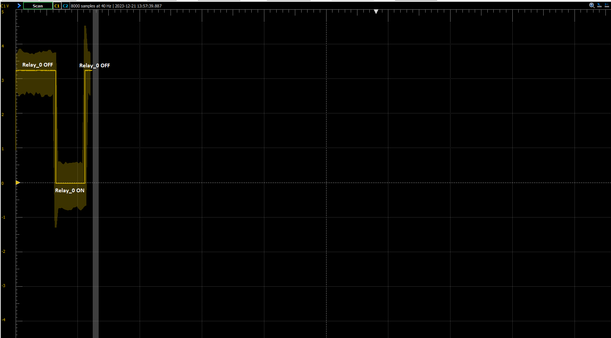

Relays of Pluto_pico
--------------------
Pluto_pico is able to control 8 relays such as from: https://www.az-delivery.de/products/8-relais-modul.

It is important that the jumper is set from VCC to JD-VCC!

Each relay has one NC-contact(normally-closed contact) and one NO-(normally-closed contact).

* If the relay is OFF the NC-contact is closed and the NO-contact will be open.
* If the relay is ON the NC-contact is open and the NO-contact is closed
* At startup each relay is set to OFF!

Relays that are ON will trigger a bright red led.
Before startup the leds will have a weak red led.
This is due to the Optokopplers in that relay module. The relays are still OFF in that state!
After startup the leds will signal the correct relay state.

.. image:: fritzing_relays.png
  :width: 400
  :alt: Fritzing model with relays

**Pin assignment**:

.. table:: GPIO Assignments and Relay Names
   :align: center

   ===================== ====================== =================
   Raspberry Pi Pico Pin   Relay Module Pin       Relay Name
   ===================== ====================== =================
   GND                    GND
   VBUS                   VCC
   GPIO9                  IN_1                    relay_0
   GPIO8                  IN_2                    relay_1
   GPIO7                  IN_3                    relay_2
   GPIO6                  IN_4                    relay_3
   GPIO5                  IN_5                    relay_4
   GPIO4                  IN_6                    relay_5
   GPIO3                  IN_7                    relay_6
   GPIO2                  IN_8                    relay_7
   ===================== ====================== =================

**Usage**:

* :code:`relays -–set-bytes <value>`
    Set relays via a bit mask. Value in decimal from 0..255.

    Examples for values:

    * :code:`0`: all relays OFF
    * :code:`5`: relais_2 and relais_0 ON, others OFF
    * :code:`255`: all relays ON

* :code:`relays –get-relay <name>`
    Gets the state of the relay <name>. State can be 0 (OFF) or 1 (ON).

    <name> can be found by calling :code:`relays -list-relays`

* :code:`relays -–set-relay <name> <state>`
    Set relay by name to specific state. State can be 0 (OFF) or 1 (ON).

    <name> can be found by calling :code:`relays -list-relays`

* :code:`relays -–list-relays`
    show all relay names

**Examples**:

Showing the GPIO signals of the raspberry pico by switching relay_0.

.. image:: relays_controlling.png
  :width: 200
  :alt: Controlling relay_0 cli view

Notice that the optocoppler are LOW_ACTIVE!

