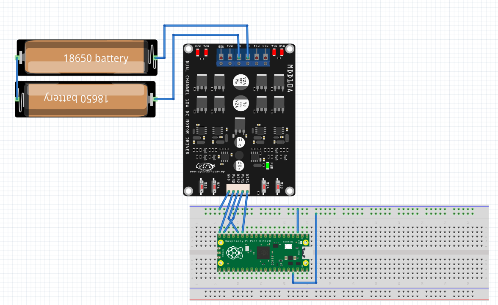
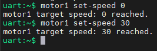
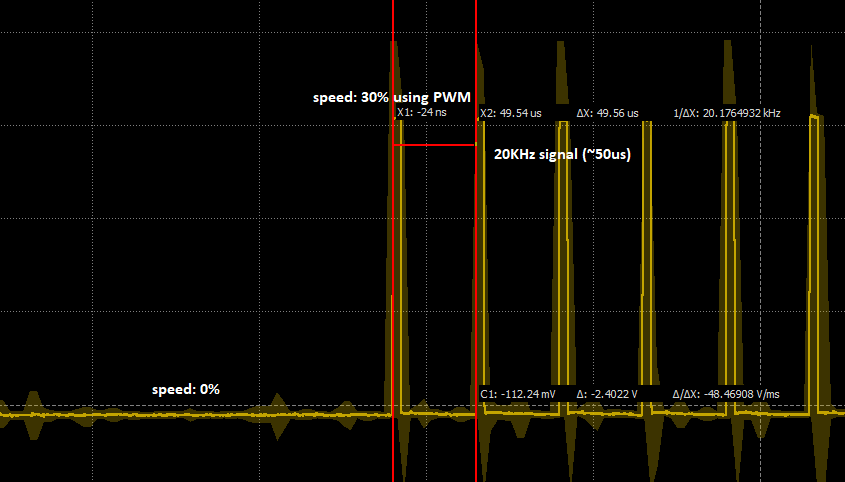
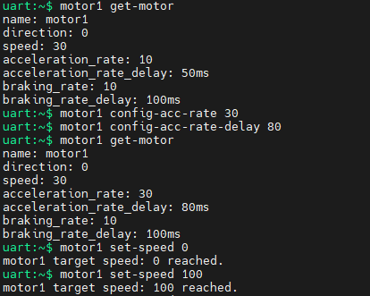
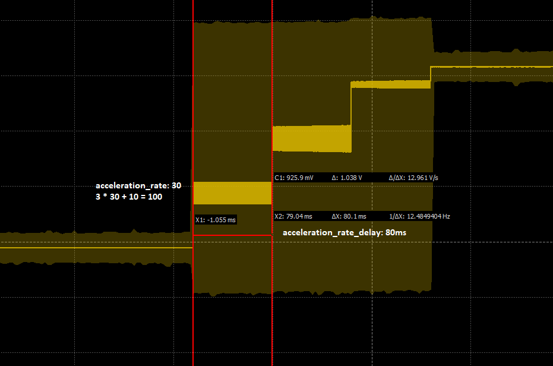
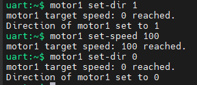
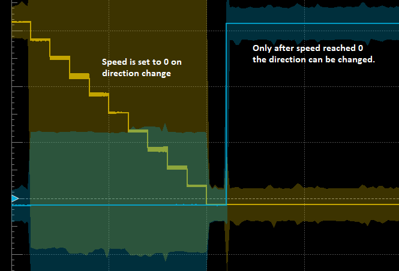
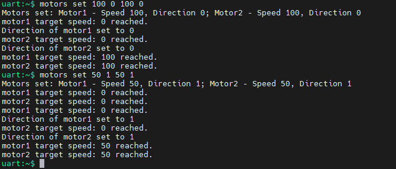
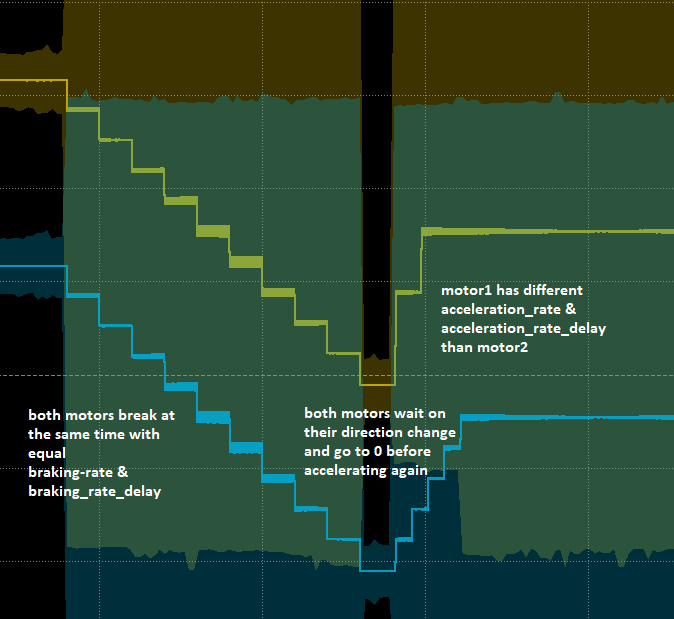

Motors of Pluto_pico
--------------------

The Motor Control Module, as part of the larger pico-pluto project, offers comprehensive functionality for controlling
motor drivers in embedded systems. This module is critical for applications such as robotics and automation, where
precise motor control is essential.

**Features**

* Control of motor speed and direction using PWM and GPIO.

* Ability to query the current state of motors.

* Integration of a command-line interface for motor control.

* Initialization and configuration capabilities for motor control hardware.

Pluto_pico is able to control 2 DC motors using the following
motorshield MDD10A: https://www.cytron.io/p-10amp-5v-30v-dc-motor-driver-2-channels.

Also other motorshields could be used just notice that the pwm frequency is set to 20kHz.

Each motor has one PWM and one DIR contact.

motors can be controlled either individually using the commands :code:`motor1` or :code:`motor2` or at once using the
:code:`motors` command.

**Pin assignment**:

.. table:: GPIO Assignments and MDD10A Names
   :align: center

   ===================== ====================== =================
   Raspberry Pi Pico Pin   MDD10A               motor name
   ===================== ====================== =================
   GND                     GND
   GPIO11                  DIR1                   motor_1
   GPIO12                  DIR2                   motor_1
   GPIO14                  PWM1                   motor_2
   GPIO15                  PWM2                   motor_2
   NC                      B+ (5V to 30VDC)
   NC                      B-
   ===================== ====================== =================

**Usage**:

motorX stands for either motor1 or motor2
Command :code:`motorX Zset-speed <0-100>` skipped since it is not recommended to use.

*  :code:`motorX set-dir <0/1>`
    Sets the direction of motorX.
    0 for one direction, 1 for the opposite direction.
*  :code:`motorX set-speed <0-100>`
    Sets the speed of motorX.
    Specify the speed as a percentage of the maximum speed (0 to 100).
*  :code:`motorX get-speed`
    Retrieves the current speed of motorX.
    Returns the speed as a percentage of the maximum speed.
*  :code:`motorX get-dir`
    Retrieves the current direction of motorX.
    Returns the direction as 0 (one direction) or 1 (opposite direction).
*  :code:`motorX get-motor`
    Retrieves the current configuration and status of motorX.
    Outputs details like speed, direction, acceleration rate, braking rate, etc.
*  :code:`motorX config-acc-rate <0-100>`
    Configures the acceleration rate of motorX.
    Specify the rate as a percentage (1 to 99).
*  :code:`motorX config-brak-rate <0-100>`
    Configures the braking rate of motorX.
    Specify the rate as a percentage (1 to 99).
*  :code:`motorX config-acc-rate-delay <ms>`
    Configures the acceleration rate delay of motorX.
    Specify the delay in milliseconds (1 to 0xFFFF).
*  :code:`motorX config-brak-rate-delay <ms>`
    Configures the braking rate delay of motorX.
    Specify the delay in milliseconds (1 to 0xFFFF).
*  :code:`motors set <speed_motor1> <dir_motor1> <speed_motor2> <dir_motor2>`
    Sets the speed (0-100) and direction (0/1) for both motor1 and motor2 simultaneously.
    Provide each motor's speed and direction as separate arguments.

**Examples**:

**Setting speed one individual motor:**

**Changing braking or acceleration rate and delay:**

**Change direction on one motor while running:**

**Set movement on both motors and change direction on both:**

