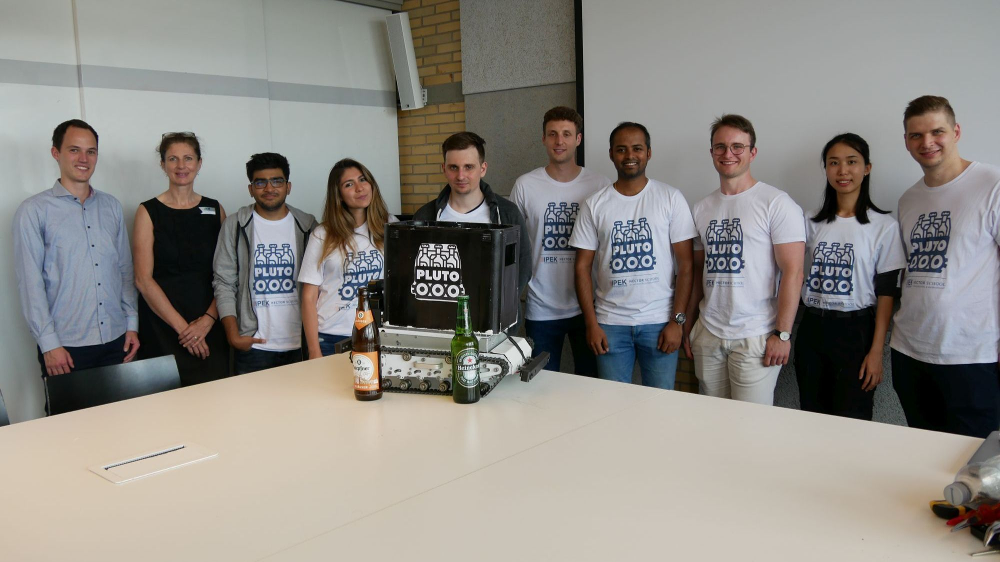

Contribution
------------

Thank you for showing interest in contributing to our project.

Contributions are always welcome! ❤️

You can help us on the following topics:

- Documentation (https://gitlab.com/pluto-ipek/pluto_docu)
- Embedded Software (https://gitlab.com/pluto-ipek/pluto_pico)
- Python GUI application (https://gitlab.com/pluto-ipek/pluto-control)
- Mobile development (https://digao.framer.wiki/pluto-beer-deliver-app-development)
- Improvements in the electronics of the robot
- Development of mechanical components

You can find out more about our Pluto team at https://plutorobot.de/pluto-6-0-team/.

Please feel free to reach out to our contributors!

Maybe you are also interesting in partnering or sponsoring our project?

Feel free to contact us aswell!

About This Documentation
~~~~~~~~~~~~~~~~~~~~~~~~

Our documentation is designed to be a comprehensive resource for understanding, using, and contributing to the
Plutobot project. For that purpose Sphinx is used.
The documentation covers a wide range of topics, including project introduction, setup instructions, usage guidelines,
and advanced configurations.

GitLab Integration
~~~~~~~~~~~~~~~~~~

Our documentation is hosted on GitLab, a platform for collaborative software development.
We take advantage of GitLab Pages, a built-in feature, to automatically build and publish our documentation to a
specific domain.
This means that our documentation is always up-to-date with the latest changes in our project repository.
The documentation is built using "Rolling Releases".

The automatic build option is done via the **.gitlab-ci-yml** script.

This repository has been forked from: https://gitlab.com/pages/sphinx

For more information please visit the gitlab documentation:
https://docs.gitlab.com/ee/user/project/pages/

Accessing the Documentation
~~~~~~~~~~~~~~~~~~~~~~~~~~~

You can access our documentation by visiting the following URL:
https://pluto_ipek.gitlab.io/pluto_docu/

This URL will take you to the hosted documentation website, where you can explore the various chapters and sections of
our documentation.

To access the sources please visit: https://gitlab.com/pluto_ipek/pluto_docu.

Contributing to the Documentation
~~~~~~~~~~~~~~~~~~~~~~~~~~~~~~~~~

We welcome contributions to our documentation from the community. If you find errors, have suggestions for improvements,
or want to add content, please feel free to create merge requests or issues on our GitLab repository.

Let's get started with exploring the documentation!
