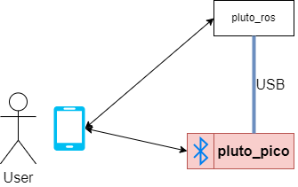

Pluto Pico
================
This chapter will explain everything you need to know about Pluto_pico.

Overview
--------
We noticed that in previous groups the project was lacking embedded software developers.
That's why we tried to focus on a microcontroller that can be used independently.
This will give future teams the possibility to exchange parts of their system such as changing the pluto_ros or
the motor_driver part.

.. image:: pluto_pico-Overview.drawio.png
  :width: 400
  :alt: Pluto with highlighted pluto_pico

Microcontroller
---------------
Pluto_pico is an embedded microcontroller that will be used to control the motor_drivers.
Pluto_pico uses the Raspberry Pi Pico W microcontroller.

.. image:: picow-pinout.svg
  :width: 400
  :alt: available connections for pluto_pico

Connections
-----------
Pluto_pico can be controlled from the outside using bluetooth or usb. This will give other groups the opportunity to
test the motor drivers, to control pluto remotely via bluetooth and to control the pluto_pico via a usb connection from
the Raspberry Pi (or any other usb host).
Both connection will use the pluto_protocol to interact with. More infos about the pluto_protocol can be found at the
chapter "Working with Pluto_pico"

The advantage of this system is additionally that it will be very easy for other teammembers to interact with the motors
in order to test and verify the drive system.

Working with Pluto_pico
-----------------------
To interact with pluto_pico an own protocol has been implemented. Following command has been implemented:

.. list-table:: Pluto Protocol
   :widths: 25 50 50
   :header-rows: 1

   * - Command
     - Usage & Description
     - Supported Arguments
   * - echo
     - | **usage:** :code:`echo <message>` or :code:`echo <argument>`
       | **description:** print back the provided message
       | no argument or message given := echo -\-help
     - | :code:`--help`: show help about command
   * - version
     - | **usage:** :code:`version` or :code:`version <argument>`
       | **description:** print back the version
       |                  of the pluto_pico firmware
       | no argument given := APP_VERSION_STRING
     - | :code:`--help`: show help about command
       | :code:`--build-ver`: APP_BUILD_VERSION

Developing Pluto_pico
---------------------
Pluto_pico is based on zephyr.
