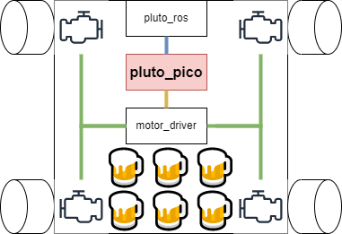
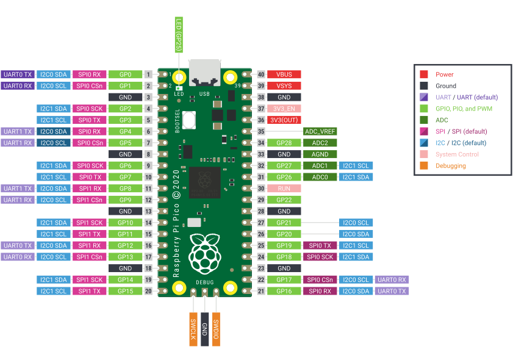

Pluto Pico
================
This chapter will explain everything you need to know about Pluto_pico.

Overview
--------
We noticed that in previous groups the project was lacking embedded software developers.
That's why we tried to focus on a microcontroller that can be used independently.
This will give future teams the possibility to exchange parts of their system such as changing the pluto_ros or
the motor_driver part.

System
------
Pluto_pico is an embedded microcontroller that will be used to control the motor_drivers.

Microcontroller
~~~~~~~~~~~~~~~

Pluto_pico uses the Raspberry Pi Pico microcontroller. To communicate with pluto-pico simply connect a usb-cable to and
open a serial connection. A list of supported commands can be found in the table below.

.. include:: 1_pluto_working_with_pico.rst
.. include:: 2_pluto_pico_developing.rst
.. include:: 3_pluto_pico_relays.rst
.. include:: 4_pluto_pico_motors.rst
