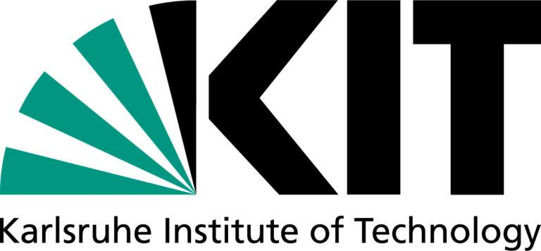
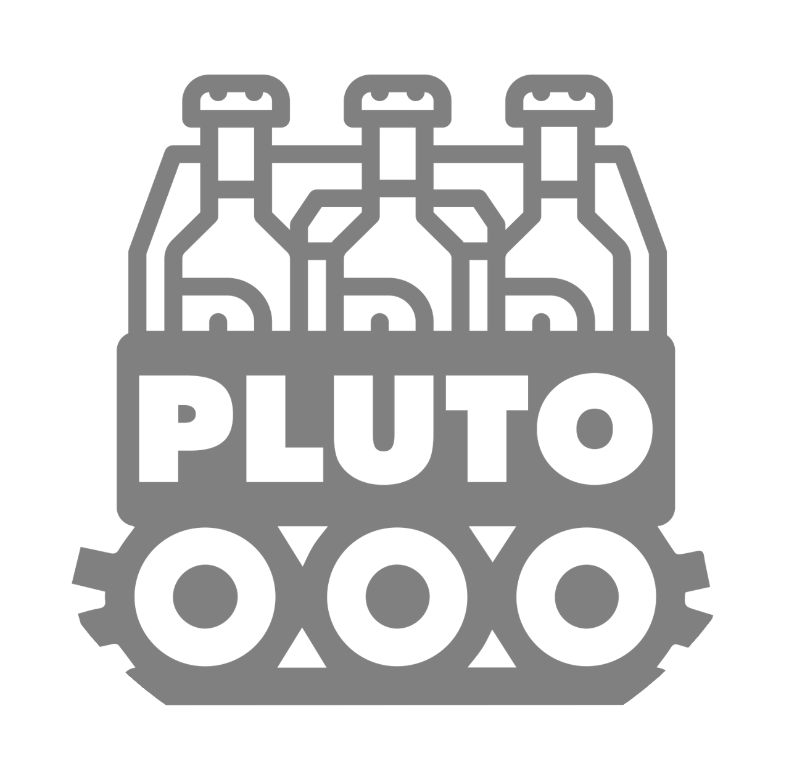
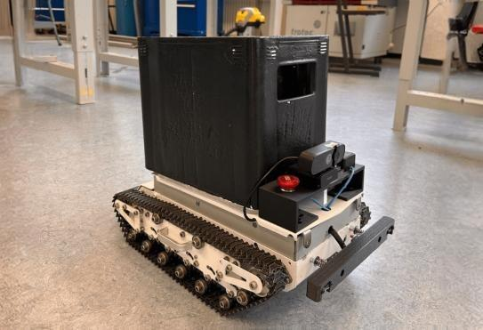
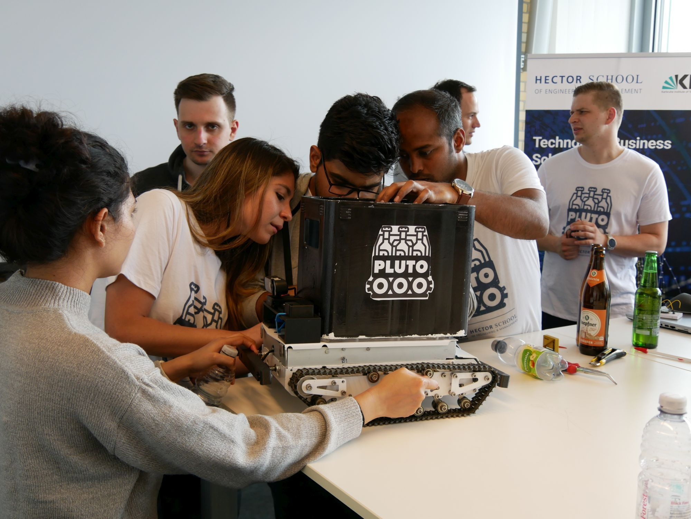

Pluto
=====

Welcome to **PLUTO**!

Pluto is an autonomous delivery robot for fresh beverages developed by the IPEK institute at
KIT (Karlsruhe Institute of Technology).

This is the software documentation for the project.

Please refer to https://plutorobot.de/ for the main projects page.

.. toctree::
   :maxdepth: 1
   :caption: Content

   docs/0_introduction/0_introduction
   docs/1_getting_started/0_getting_started
   docs/3_pluto_pico/0_pluto_pico
   docs/4_contribution/0_contribution

